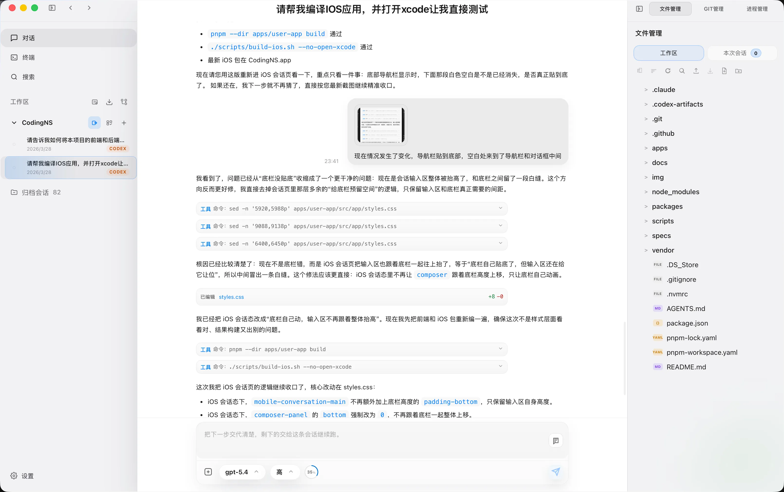
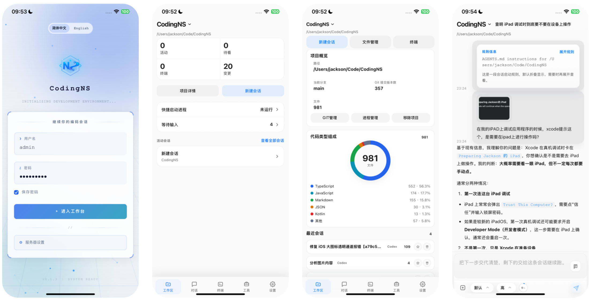

<div align="center">

# CodingNS

**随时随地，AI编程不间断**

**AI Coding Anytime, Anywhere**

[](https://nodejs.org/)
[](https://pnpm.io/)
[](https://tauri.app/)
[](#)
[](#)

[English](#english) | [中文](#中文)

</div>

---

## 中文

### 🎯 项目愿景

CodingNS 致力于提供一整套闭环的 AI 编程工作流程，让你能够随时随地通过任何客户端进行 AI 编程。无论你使用桌面电脑、移动设备还是 Web 浏览器，都能无缝续接你的 AI 编程会话。

支持H5、Windows、macOS，均保持一致体验；

全面支持Android、IOS移动端，全功能使用。

### ✨ 核心特性

#### 🔄 多 Provider 会话同步
- **无缝续接原生 CLI 会话**：支持 Claude Code、Codex、OpenCode 等主流 AI 编程工具
- **会话发现与历史读取**：自动发现并同步本地 CLI 会话历史
- **实时消息订阅**：实时接收和展示 AI 编程会话的消息流
- **会话状态感知**：统一展示运行中、未读、失败等状态，并保留错误码与错误摘要
- **会话事件通知**：权限申请、会话完成与失败等事件的 Toast 通知，支持一键跳转
- **子会话识别**：正确识别并归类 CLI 的子 Agent 会话，避免与主会话混淆
- **消息归一化**：统一不同 Provider 的消息格式，提供一致的使用体验

#### 💬 对话式主界面
- **会话即工作区**：每个对话都是一个独立的工作区，统一管理上下文
- **实时消息渲染**：支持 Markdown、代码高亮、工具调用展示
- **统一权限审批**：在会话内直接处理命令执行、文件变更、权限授权和用户输入请求
- **权限模式隔离**：「完全权限」与「二次审批 Hook」明确隔离，避免权限误判
- **复合输入面板**：集成文件上传、上下文管理、快捷命令等功能
- **演示模式**：支持通过 `codingns start --demo` 启动演示环境，自动创建 demo 账号并提供受控体验
- **Capability 驱动**：根据 Provider 能力动态调整可用功能

#### 📁 文件管理能力
- **文件树浏览**：可视化项目文件结构
- **文件上下文挂载**：将文件内容快速添加到会话上下文
- **文件搜索**：快速定位项目中的文件
- **变更视图增强**：支持 Git 状态标记、变更筛选与 Diff 预览
- **路径联动与清爽视图**：支持从聊天内容定位文件，并可默认隐藏系统文件

#### 🔀 Git 集成
- **Git 状态展示**：实时查看文件变更状态
- **提交流程集成**：在会话中直接完成代码提交
- **多远程推送**：支持一次推送多个远程仓库
- **规则校验**：支持自定义提交规则

#### 💻 终端能力
- **真实 PTY 终端**：基于 node-pty 的完整终端体验
- **多终端支持**：同时管理多个终端会话
- **终端持久化**：终端输出缓存与历史回放
- **回放体验优化**：修复历史回放与实时输出衔接时的滚动和时序问题
- **Windows 终端恢复**：支持终端持久化恢复，并在创建前选择 Shell
- **断线重连**：网络中断后自动恢复终端会话

#### ☁️ 账户偏好同步
- **账户级配置同步**：语言、主题、默认权限模式可在多客户端之间同步
- **Provider 默认项同步**：支持同步默认模型与默认推理强度
- **本地偏好分层**：界面类偏好保留本地，避免把设备相关设置硬同步到所有端

#### 🎨 极简界面设计
- **软件工程师审美**：专注于功能性与美感的平衡
- **零干扰体验**：去除冗余装饰，突出核心工作区域
- **高信息密度**：合理利用屏幕空间，展示更多有效信息
- **快捷操作优先**：键盘优先、手势辅助的高效交互
- **主题定制**：支持亮色/暗色主题，适应不同工作环境

#### ⚙️ 进程管理
- **开发服务器管理**：启动、监控、停止开发进程
- **端口识别**：自动识别进程端口占用
- **日志追踪**：实时查看进程输出日志
- **反向代理**：通过单一端口代理开发中的应用，支持 HTTP/WebSocket 双协议透传与文件上传

#### 🪟 桌面工作台能力
- **多窗口支持**：支持将文件、Git、终端管理等工具面板拆分为独立窗口
- **拖拽拆分体验**：支持从工作台直接拖拽标签页到独立窗口，减少来回切换
- **窗口状态管理**：统一维护独立窗口的打开状态、焦点和恢复逻辑

#### 📱 多平台支持
- **桌面端**：基于 Tauri 的原生桌面应用（macOS、Windows、Linux）
- **移动端**：iOS 和 Android 原生应用（Tauri Mobile）
- **Web 端**：现代浏览器访问
- **平台适配**：针对不同平台优化的 UI 和交互
- **移动端体验修复**：补齐启动图资源，优化 iPad 横竖屏、安全区以及聊天附件调用相机/相册的体验

#### 🔌 Provider 扩展框架
- **统一扩展协议**：标准化的 Provider 接入规范
- **能力声明**：Provider 自身能力的声明与发现
- **兼容性测试**：内置 Provider 兼容性测试样本

### 🏗️ 项目架构

```
CodingNS/
├── apps/
│   ├── host/           # 后端服务（Fastify + WebSocket）
│   ├── user-app/       # 前端应用（React + Tauri）
│   └── desktop/        # 桌面端壳工程
├── packages/
│   ├── session-sync-core/  # 会话同步核心库
│   └── codingns/       # 独立 NPM 包（all-in-one）
├── specs/              # 功能规格文档
└── scripts/            # 构建与部署脚本
```

#### 核心组件说明

| 组件 | 技术栈 | 说明 |
|------|--------|------|
| **Host** | Fastify + WebSocket + SQLite + node-pty | 后端服务，提供 HTTP/WebSocket API，管理会话、终端、进程 |
| **User App** | React + TypeScript + Tauri | 跨平台客户端应用 |
| **Session Sync Core** | TypeScript | 核心 SDK，封装会话同步、Provider 适配逻辑 |
| **CodingNS Package** | Node.js | 可独立安装的 NPM 包，包含完整后端能力 |

### 🚀 快速开始

#### 环境要求

- **npm** >= 10.0.0
- **Node.js** >= 22.0.0
- **pnpm** >= 9.0.0
- **Rust** >= 1.70（桌面端开发需要）

#### 通过 NPM 包快速安装

```bash
# 全局安装
npm install -g @jingyi0605/codingns

# 启动服务
codingns start --port 3002
```

也可以不全局安装，直接临时启动：

```bash
npx @jingyi0605/codingns start --port 3002
```

常用参数：

- `--host`：监听地址，默认 `0.0.0.0`
- `--port`：监听端口，默认 `3002`
- `--data-dir`：数据目录，默认 `~/.codingns`
- `--demo`：以演示模式启动，自动创建 demo 账号，并启用受控演示会话

#### 通过 PM2 开机启动和自定义端口

先安装 PM2：

```bash
npm install -g pm2
```

使用 PM2 托管，并自定义端口和数据目录：

```bash
pm2 start "$(which codingns)" --name codingns -- start --host 0.0.0.0 --port 3300 --data-dir ~/.codingns
```

保存当前进程列表并生成开机自启配置：

```bash
pm2 save
pm2 startup
```

执行 `pm2 startup` 输出的那条系统命令后，再执行一次：

```bash
pm2 save
```

常用 PM2 命令：

```bash
pm2 status
pm2 logs codingns
pm2 restart codingns
pm2 stop codingns
```

#### 从源码开发

```bash
# 克隆仓库
git clone https://git.jacksonz.cn:4443/jackson/CodingNS.git
cd codingns

# 安装依赖
pnpm install

# 重新编译原生模块（如果需要）
pnpm rebuild:native

# 查看开发帮助
pnpm dev

# 启动后端服务
pnpm dev:backend

# 启动前端开发服务器
pnpm dev:frontend

# 启动桌面端开发模式
pnpm dev:desktop
```

#### 构建

```bash
# 构建核心库
pnpm build:session-sync-core

# 构建后端服务
pnpm build:host

# 构建前端应用
pnpm build:user-app

# 构建桌面应用
pnpm build:desktop

# 构建独立 NPM 包
pnpm build:standalone
```

#### 测试

```bash
# 测试后端服务
pnpm test:host

# 测试前端应用
pnpm test:user-app
```

### 🛠️ 技术栈

**后端**
- [Fastify](https://fastify.dev/) - 高性能 Web 框架
- [WebSocket (ws)](https://github.com/websockets/ws) - 实时通信
- [better-sqlite3](https://github.com/WiseLibs/better-sqlite3) - SQLite 数据库
- [node-pty](https://github.com/microsoft/node-pty) - 伪终端支持

**前端**
- [React 18](https://react.dev/) - UI 框架
- [TypeScript](https://www.typescriptlang.org/) - 类型安全
- [Vite](https://vitejs.dev/) - 构建工具
- [xterm.js](https://xtermjs.org/) - 终端模拟器
- [Tauri 2](https://tauri.app/) - 跨平台桌面/移动应用框架

**测试**
- [Vitest](https://vitest.dev/) - 单元测试
- [Testing Library](https://testing-library.com/) - React 组件测试

### 📖 文档

详细的功能规格和设计文档位于 [`specs/`](./specs/) 目录：

- **spec001** - 平台底座与工作区基础
- **spec001.1** - 账户偏好入库与跨客户端同步
- **spec002** - ClaudeCode 与 Codex 会话同步核心
- **spec003** - 对话式主界面与消息运行时
- **spec003.1** - 原生会话实时对话运行时
- **spec003.2** - 运行中消息追加与原生引导
- **spec003.3** - 运行时消息直推与稳定标识
- **spec003.4** - 会话活动状态权威源与稳定显示
- **spec004** - 文件管理能力
- **spec005** - Git 上下文与提交规则引擎
- **spec006** - 终端核心能力
- **spec006.1** - 终端日志持久化与历史回放
- **spec007** - 进程管理与启动器
- **spec008** - 桌面端与 H5 交付增强
- **spec009** - 移动端体验与通知
- **spec009.1** - 移动端工作台导航与信息架构重构
- **spec010** - Provider 扩展框架
- **spec010.1** - OpenCode 兼容接入
- **spec010.2** - Gemini CLI 兼容接入
- **spec010.3** - Kimi CLI 兼容接入
- **spec011** - 单包安装与统一服务发布
- **spec012** - 并行项目编排与结果对比
- **spec013** - 代码助手平台与跨工作区巡检编排

### 🗺️ 路线图

| 开发目标 | 当前进度 | 完成情况 |
|----------|----------|----------|
| 进程管理支持反向代理，单一端口代理开发中的应用 | 已完成 | 🟢 已完成 |
| iOS APP | 开发中（提审准备已完成） | 🟡 进行中 |
| 演示模式与受控演示环境 | 已完成 | 🟢 已完成 |
| 并行开发模式，同时启动多个 CLI 或模型配置，并行针对单一工作区进行快速开发验证 | 规划中 | ⬜ 计划中 |
| 支持更多 CLI（Gemini CLI、Kimi CLI 等） | 规划中 | ⬜ 计划中 |
| 支持同时连接多个 HOST | 规划中 | ⬜ 计划中 |
| PC 端支持多窗口操作 | 已完成 | 🟢 已完成 |
| 更好的文件编辑器体验 | 规划中 | ⬜ 计划中 |
| 内置 Tailscale 支持一键穿透内网 | 规划中 | ⬜ 计划中 |
| 代码助手功能，支持跨工作区管理多个项目及会话，并为用户提供项目开发的建议和代替用户进行项目开发的控制 | 规划中 | ⬜ 计划中 |
| 代码助手支持实时语音对话 | 规划中 | ⬜ 计划中 |

> 进度说明：🟢 已完成 | 🟡 开发中 | ⬜ 计划中

### 🤝 贡献

欢迎贡献代码、报告问题或提出建议！

### 📄 许可证

本项目采用 MIT 许可证。

---

## English

### 🎯 Vision

CodingNS provides a complete closed-loop AI programming workflow, enabling you to code with AI anytime, anywhere, from any client. Whether you're on desktop, mobile, or web browser, seamlessly continue your AI coding sessions across all platforms.

### ✨ Core Features

#### 🔄 Multi-Provider Session Sync
- **Seamless CLI Session Continuation**: Support for Claude Code, Codex, OpenCode and other mainstream AI programming tools
- **Session Discovery & History**: Automatically discover and sync local CLI session history
- **Real-time Message Subscription**: Receive and display AI coding session message streams in real-time
- **Session State Awareness**: Consistent running, unread, and failure states with error codes and summaries
- **Session Event Notifications**: Toast notifications for permission requests, session completion, and failures with one-click navigation
- **Sub-Agent Recognition**: Correctly identify and classify CLI sub-Agent sessions separately from main sessions
- **Message Normalization**: Unified message format across different providers for consistent experience

#### 💬 Conversational Interface
- **Session as Workspace**: Each conversation is an independent workspace with unified context management
- **Real-time Message Rendering**: Support for Markdown, syntax highlighting, and tool call visualization
- **Unified Permission Handling**: Review command execution, file changes, permission grants, and user-input requests inside the conversation
- **Permission Mode Isolation**: Clear separation between "full permission" and "secondary approval hook" modes
- **Compound Input Panel**: Integrated file upload, context management, and quick commands
- **Demo Mode**: Start a controlled demo environment with `codingns start --demo`, including an auto-created demo account
- **Capability-Driven**: Dynamically adjust available features based on provider capabilities

#### 📁 File Management
- **File Tree Browser**: Visualize project file structure
- **File Context Mounting**: Quickly add file contents to session context
- **File Search**: Quickly locate files in your project
- **Change-focused Views**: Git status badges, change filters, and diff preview
- **Path Linking & Cleaner Trees**: Jump from chat paths to files and hide system files by default when needed

#### 🔀 Git Integration
- **Git Status Display**: Real-time view of file change status
- **Commit Workflow Integration**: Complete code commits directly within sessions
- **Multi-remote Push**: Push to multiple remotes in one action
- **Rule Validation**: Support for custom commit rules

#### 💻 Terminal Capabilities
- **Real PTY Terminal**: Complete terminal experience based on node-pty
- **Multi-Terminal Support**: Manage multiple terminal sessions simultaneously
- **Terminal Persistence**: Terminal output caching and history playback
- **Replay Stability Improvements**: Fix timing and scrolling issues between history replay and live output
- **Windows Terminal Recovery**: Restore persisted terminals and choose the shell before creation
- **Reconnection**: Automatic terminal session recovery after network interruption

#### ☁️ Account Preference Sync
- **Account-level Settings Sync**: Language, theme, and default permission mode follow your account across clients
- **Provider Defaults Sync**: Keep default model and reasoning level in sync
- **Local Preference Layering**: Device-specific UI preferences stay local instead of being forced onto every client

#### 🎨 Minimalist Interface Design
- **Engineer-Centric Aesthetics**: Balance between functionality and beauty
- **Zero Distraction**: Remove redundant decorations, highlight core work areas
- **High Information Density**: Rational use of screen space, display more effective information
- **Efficient Interaction**: Keyboard-first, gesture-assisted interactions
- **Theme Customization**: Light/dark theme support for different working environments

#### ⚙️ Process Management
- **Dev Server Management**: Start, monitor, and stop development processes
- **Port Detection**: Automatic identification of process port usage
- **Log Tracking**: Real-time process output logging
- **Reverse Proxy**: Proxy dev apps through a single port with HTTP/WebSocket passthrough and file upload support

#### 🪟 Desktop Workbench
- **Multi-window Support**: Detach file, Git, and terminal-management panels into independent windows
- **Drag-to-detach Workflow**: Drag workbench tabs into their own windows for side-by-side work
- **Window State Management**: Keep detached window state, focus, and reopen behavior consistent

#### 📱 Multi-Platform Support
- **Desktop**: Native desktop applications (macOS, Windows, Linux) based on Tauri
- **Mobile**: iOS and Android native applications (Tauri Mobile)
- **Web**: Modern browser access
- **Platform Adaptation**: UI and interactions optimized for different platforms
- **Mobile Experience Fixes**: Updated splash assets and improved iPad orientation, safe-area, and attachment picker behavior

#### 🔌 Provider Extension Framework
- **Unified Extension Protocol**: Standardized provider integration specification
- **Capability Declaration**: Provider self-capability declaration and discovery
- **Compatibility Testing**: Built-in provider compatibility test samples

### 🏗️ Architecture

```
CodingNS/
├── apps/
│   ├── host/           # Backend service (Fastify + WebSocket)
│   ├── user-app/       # Frontend app (React + Tauri)
│   └── desktop/        # Desktop shell project
├── packages/
│   ├── session-sync-core/  # Session sync core library
│   └── codingns/       # Standalone NPM package (all-in-one)
├── specs/              # Feature specification documents
└── scripts/            # Build and deployment scripts
```

#### Core Components

| Component | Tech Stack | Description |
|-----------|------------|-------------|
| **Host** | Fastify + WebSocket + SQLite + node-pty | Backend service providing HTTP/WebSocket APIs, managing sessions, terminals, and processes |
| **User App** | React + TypeScript + Tauri | Cross-platform client application |
| **Session Sync Core** | TypeScript | Core SDK encapsulating session sync and provider adaptation logic |
| **CodingNS Package** | Node.js | Standalone NPM package with complete backend capabilities |

### 🚀 Quick Start

#### Requirements

- **Node.js** >= 22.0.0
- **npm** >= 10.0.0
- **pnpm** >= 9.0.0
- **Rust** >= 1.70 (required for desktop development)

#### Install From npm

```bash
# Install globally
npm install -g @jingyi0605/codingns

# Start service
codingns start --port 3002
```

You can also run it without global install:

```bash
npx @jingyi0605/codingns start --port 3002
```

Common options:

- `--host`: listen host, default `0.0.0.0`
- `--port`: listen port, default `3002`
- `--data-dir`: data directory, default `~/.codingns`
- `--demo`: start in demo mode with an auto-created demo account and controlled demo sessions

#### Start On Boot With PM2

Install PM2:

```bash
npm install -g pm2
```

Run the service with a custom port and data directory:

```bash
pm2 start "$(which codingns)" --name codingns -- start --host 0.0.0.0 --port 3300 --data-dir ~/.codingns
```

Save the process list and generate startup configuration:

```bash
pm2 save
pm2 startup
```

After executing the system command printed by `pm2 startup`, run:

```bash
pm2 save
```

Common PM2 commands:

```bash
pm2 status
pm2 logs codingns
pm2 restart codingns
pm2 stop codingns
```

#### Develop From Source

```bash
# Clone repository
git clone https://git.jacksonz.cn:4443/jackson/CodingNS.git
cd codingns

# Install dependencies
pnpm install

# Rebuild native modules (if needed)
pnpm rebuild:native

# View development help
pnpm dev

# Start backend service
pnpm dev:backend

# Start frontend dev server
pnpm dev:frontend

# Start desktop development mode
pnpm dev:desktop
```

#### Build

```bash
# Build core library
pnpm build:session-sync-core

# Build backend service
pnpm build:host

# Build frontend app
pnpm build:user-app

# Build desktop app
pnpm build:desktop

# Build standalone NPM package
pnpm build:standalone
```

#### Test

```bash
# Test backend service
pnpm test:host

# Test frontend app
pnpm test:user-app
```

### 🛠️ Tech Stack

**Backend**
- [Fastify](https://fastify.dev/) - High-performance web framework
- [WebSocket (ws)](https://github.com/websockets/ws) - Real-time communication
- [better-sqlite3](https://github.com/WiseLibs/better-sqlite3) - SQLite database
- [node-pty](https://github.com/microsoft/node-pty) - Pseudo terminal support

**Frontend**
- [React 18](https://react.dev/) - UI framework
- [TypeScript](https://www.typescriptlang.org/) - Type safety
- [Vite](https://vitejs.dev/) - Build tool
- [xterm.js](https://xtermjs.org/) - Terminal emulator
- [Tauri 2](https://tauri.app/) - Cross-platform desktop/mobile framework

**Testing**
- [Vitest](https://vitest.dev/) - Unit testing
- [Testing Library](https://testing-library.com/) - React component testing

### 📖 Documentation

Detailed feature specifications and design documents are located in the [`specs/`](./specs/) directory:

- **spec001** - Platform Foundation & Workspace Basics
- **spec001.1** - Account Preference Persistence & Cross-client Sync
- **spec002** - ClaudeCode & Codex Session Sync Core
- **spec003** - Conversational Interface & Message Runtime
- **spec003.1** - Native Session Realtime Conversation Runtime
- **spec003.2** - In-progress Message Appending & Native Onboarding
- **spec003.3** - Runtime Message Push & Stable Identifiers
- **spec003.4** - Session Activity Authority & Stable Display
- **spec004** - File Management Capabilities
- **spec005** - Git Context & Commit Rule Engine
- **spec006** - Terminal Core Capabilities
- **spec006.1** - Terminal Log Persistence & History Replay
- **spec007** - Process Management & Launcher
- **spec008** - Desktop & H5 Delivery Enhancements
- **spec009** - Mobile Experience & Notifications
- **spec009.1** - Mobile Workbench Navigation & Information Architecture
- **spec010** - Provider Extension Framework
- **spec010.1** - OpenCode Compatibility Integration
- **spec010.2** - Gemini CLI Compatibility Integration
- **spec010.3** - Kimi CLI Compatibility Integration
- **spec011** - Single-package Install & Unified Service Delivery
- **spec012** - Parallel Project Orchestration & Result Comparison
- **spec013** - Code Butler Platform & Cross-workspace Inspection Orchestration

### 🗺️ Roadmap

| Goal | Progress | Status |
|------|----------|--------|
| Reverse proxy for process management — proxy dev apps through a single port | Completed | 🟢 Completed |
| iOS APP | In development (App Store submission prep completed) | 🟡 In Progress |
| Demo mode and controlled demo environment | Completed | 🟢 Completed |
| Parallel dev mode — launch multiple CLI or model configs simultaneously for rapid dev validation on a single workspace | Planning | ⬜ Planned |
| Support more CLIs (Gemini CLI, Kimi CLI, etc.) | Planning | ⬜ Planned |
| Support connecting to multiple hosts simultaneously | Planning | ⬜ Planned |
| Multi-window support on desktop | Completed | 🟢 Completed |
| Better file editor experience | Planning | ⬜ Planned |
| Built-in Tailscale for one-click NAT traversal | Planning | ⬜ Planned |
| Code Butler — manage multiple projects and sessions across workspaces, provide dev suggestions and act on behalf of the user | Planning | ⬜ Planned |
| Code Butler with real-time voice conversation | Planning | ⬜ Planned |

> Status legend: 🟢 Completed | 🟡 In Progress | ⬜ Planned

### 🤝 Contributing

Contributions, bug reports, and suggestions are welcome!

### 📄 License

This project is licensed under the MIT License.

---

<div align="center">

**Made with ❤️ by CodingNS Team**

</div>
