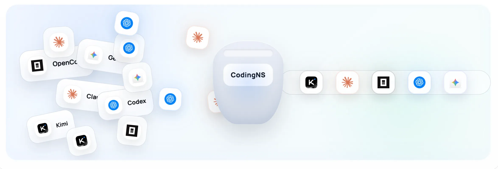
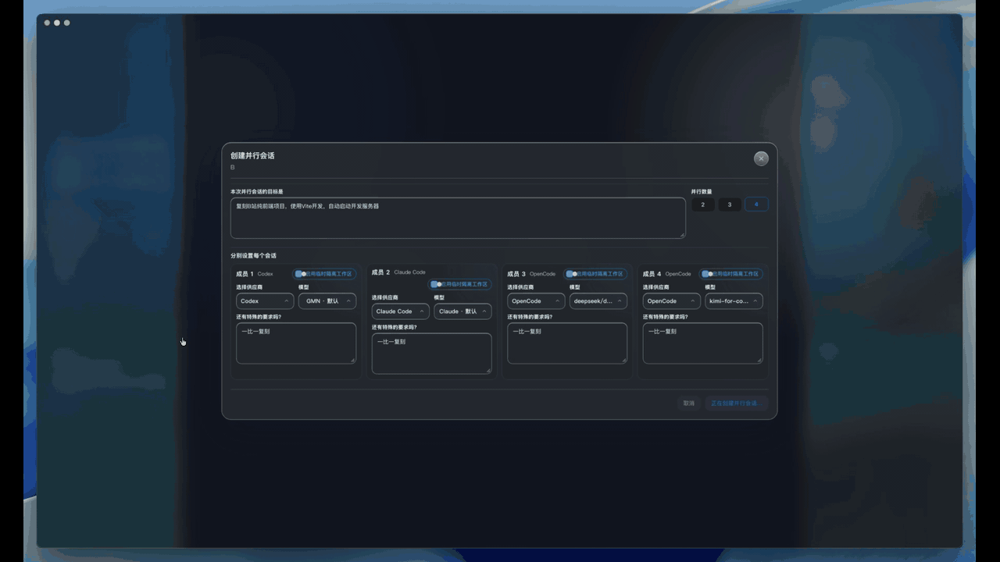
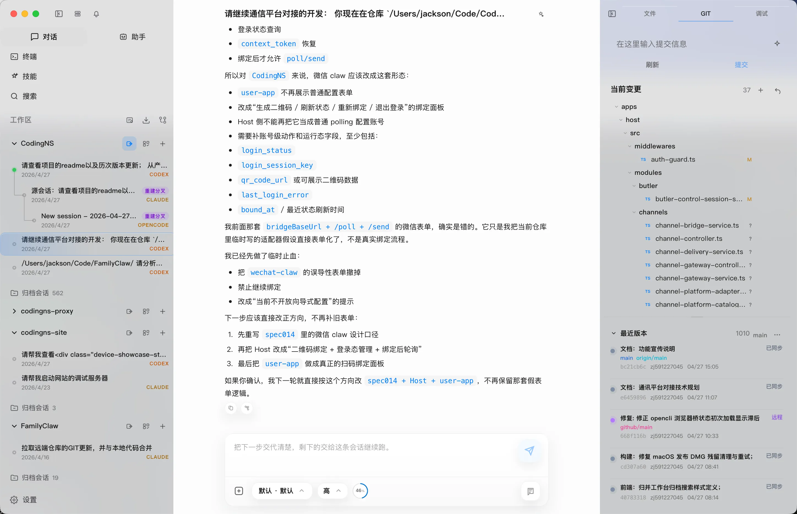
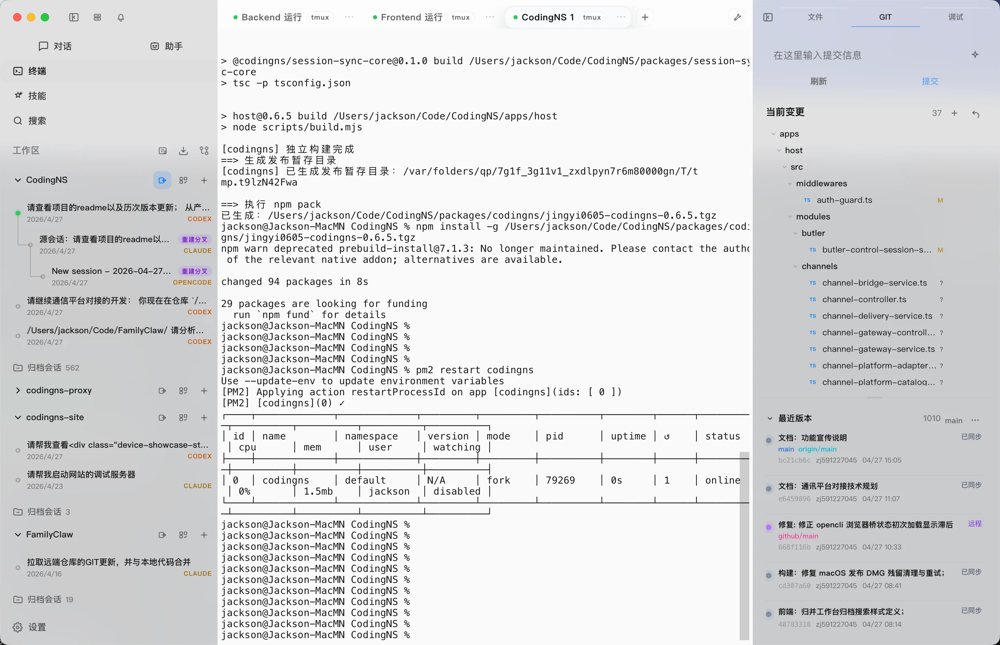
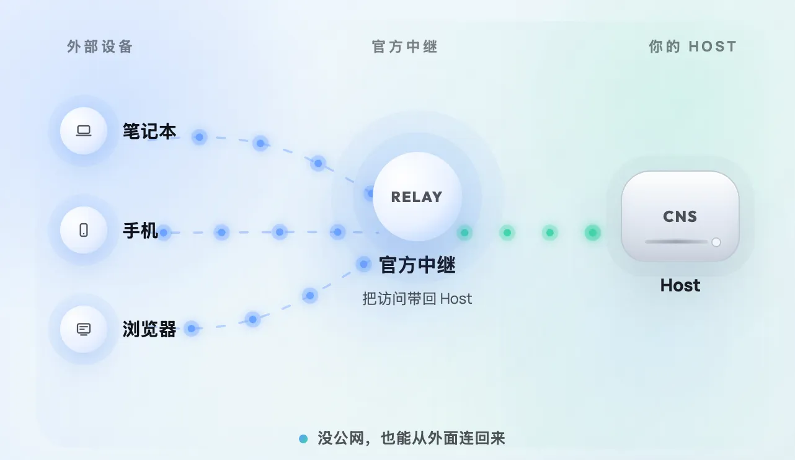

# 写了一半，换台设备，接着写。

将CodingNS部署到常开机的工作站，你就拥有了一个随时可以接入的移动工作台：
笔记本电脑对话到一半，合上就走。掏出手机，对话记录还在那里，跟没关过机一样。

CodingNS 把 AI 聊天、代码、文件、终端、Git 揉成一个工作台，让你在哪都能接着干。

## 你的 AI 你说了算，不用挑

Codex、Claude、OpenCode、Gemini、Kimi。不用装一堆、不用记哪个窗口聊过什么。装一个 CodingNS，想用谁点谁。

问题拿不准？同时问多个AI，谁先答好用谁的——让机器替你抢时间。

## 聊天在哪，效率就在哪

窗口打开就是对话。文件树、编辑器、终端、Git 围着它摆好。不翻菜单，不记入口，想问就问，想改就改。

## 终端就是那个终端，断了也能回来

多标签、命令历史、输出一句不丢。网断了它自己重连，跑了半小时的脚本不用重来。

写完代码顺手瞄一眼：服务起来了没、端口占没占、日志报没报错——一个地方全看见，不多费一步。

## 机器在哪不重要

办公室的电脑、家里的主机、机房的测试机——自动发现、自动挑最快的路连进去。出门只带手机，照样进开发环境干活。

## 分支会话，一个目标，多个思路
把主干和所有分支直接展开，切换、回看、比较都更直观，特别适合头脑风暴时同时保留多条思路。
Codex 卡住了，就从当前节点直接分一支给 Claude Code 或别的模型继续试，不用重讲背景，不用重建上下文。
